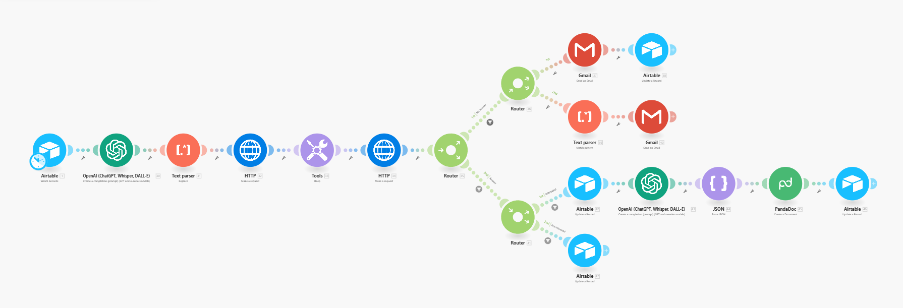

# 🤖 Airtable → OpenAI → VAPI Voice Agent Automation

📌 File: `airtable-openai-vapi-panda.blueprint.json`

This workflow demonstrates an **end-to-end automation pipeline** that connects **Airtable**, **OpenAI**, **VAPI Voice Agent**, and **Google Email**.  
It is designed for **lead management and business development**, combining **AI-powered analysis**, **automated phone calls**, and **automatic proposal delivery**.

---

## 📌 Workflow Overview

1. **Trigger (Airtable)**  
   - Workflow starts when a new lead is created or updated in Airtable.  

2. **AI Analysis (OpenAI)**  
   - Lead details are passed to OpenAI, which generates a professional summary about the company, their potential goals, and how we can help them.  
   - This ensures every outreach is **personalized and context-aware**.  

3. **Voice Call (VAPI Voice Agent)**  
   - VAPI automatically calls the lead using the AI-generated summary.  
   - The message is tailored to sound natural and professional.  

4. **Conditional Paths**  
   - **If unanswered** → Google Email sends a polite follow-up message.  
   - **If answered but declined** → Airtable is updated with the rejection status.  
   - **If answered and prospect agrees** → the system **automatically sends a proposal email** with pre-set templates and logs the interaction.  

5. **Database Update (Airtable)**  
   - Airtable records are updated with:  
     - Call status (answered / not answered / rejected / agreed)  
     - Follow-up email status  
     - Proposal sent timestamp  

---

## 🖼️ Workflow Diagram

---

## ✨ Benefits

- **AI-Powered Personalization** → every call/email is tailored to the prospect.  
- **Multi-Channel Outreach** → combines voice + email for higher engagement.  
- **Automatic Proposal Delivery** → no manual steps after a positive call.  
- **End-to-End Tracking** → Airtable serves as the single source of truth for all interactions.  
- **Faster Sales Cycle** → reduces workload, ensures no lead is missed.  

---

## ⚙️ Setup Instructions

1. Import the `blueprint.json` file into **n8n** or **Make**.  
2. Replace placeholders with your real credentials:  
   - `{AIRTABLE_BASE_ID}` / `{AIRTABLE_TABLE_ID}` → Airtable connection  
   - `{API_KEY}` → OpenAI API key  
   - `{ASSISTANT_ID}`, `{PHONE_NUMBER_ID}` → VAPI configuration  
   - `{GOOGLE_ACCOUNT_ID}` → Google email account for follow-up & proposals  
3. Test the workflow end-to-end before deploying to production.  

---

## 📌 Notes

- All sensitive credentials have been **sanitized** with placeholders.  
- You need to set up your own **Airtable base**, **OpenAI key**, and **VAPI account** for this workflow to run.  
- Proposal templates can be customized in the email module.  

---

## 🚀 Use Cases

This workflow is ideal for:  
- **Sales teams** → automate lead calls, follow-ups, and proposal sending.  
- **Startups** → scale outreach with minimal manual effort.  
- **Agencies** → streamline business development and maintain professional, consistent communication.  

---

✅ **Result:** A fully automated lead management system — from data capture in Airtable → AI summary → voice call → follow-up email → proposal delivery → database update.
